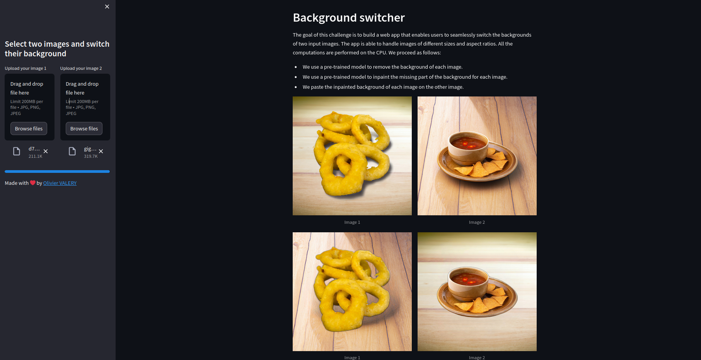
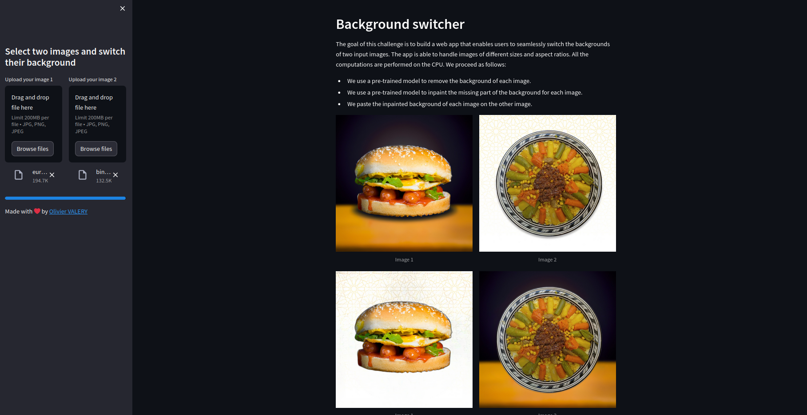
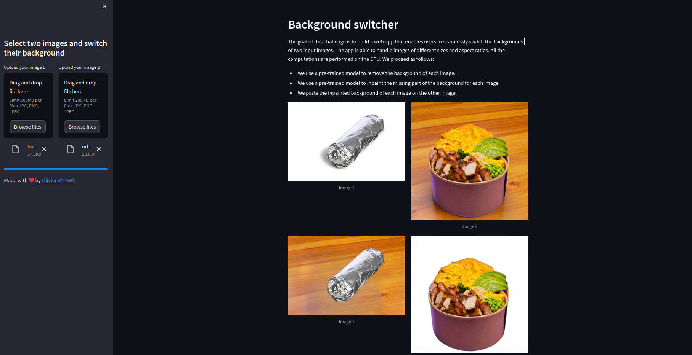

# Background Switcher

The background switcher is a webapp running under Streamlit. It allows a user to seamlessly switch the backgrounds of two images. In addition, 
this app is able to handle images of different sizes and aspect ratios. For the sake of portability, all the computations are performed on the CPU.

The app proceeds as follows:
1. It uses a pre-trained model (U2net) to remove the background of each image.
2. It uses a pre-trained model (Big-LaMa) to inpaint the missing part of the background for each image.
3. It pastes the inpainted background of each image on the other image.

Please note that [U2net](https://arxiv.org/pdf/2005.09007.pdf) has been optimized for speed using ONNX Runtime. For image inpainting, we use [Big-LaMa](https://arxiv.org/abs/2109.07161). It takes advantage of Fourier Convolutions with an image-wide receptive field, allowing it to effectively inpaint large missing regions. I attempt to optimize Big-lama myself. Unfortunately, ONNX Runtime does not support Fourier Convolutions as the mathematical operations. Therefore, image inpainting is performed using PyTorch, which leads to slightly longer execution times during step 2 of the process.


## Installation

# Docker 

Just run the following command in the root directory of the project:

```bash
docker build -t myapp .
```
    
Then, run the following command to start the app:

```bash
docker run -p 8501:8501 myapp
```
Please note that it may take a few minutes to start the app for the first time.

# Manual Installation

To install the app, you need to clone the repository and install the requirements using the following commands:

```bash
git clone git@github.com:OValery16/background-switcher.git
cd background-switcher
pip install -r requirements.txt
streamlit run app.py
```

## Usage

After launching the app, you can upload two images using the left sidebar buttoms. The app will then proceed to swap their backgrounds and display the modified images alongside the original ones.







